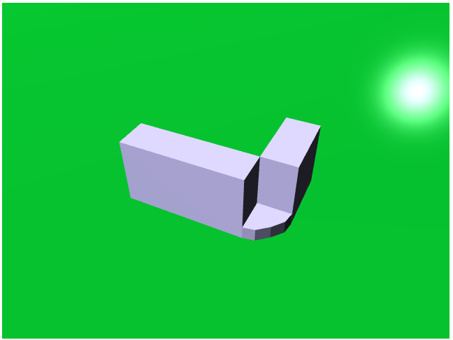

# Taganka8 3D

## Simple WebGL application made on Typescript

The application renders the model of the building:
* The building and ground geometry is stored in one GLTF primitive;
* The scene is lit with two direct light sources:
  * Source #1 - diffuse light;
  * Source #2 - diffuse light;
  * Source #2 - specular light;
  * ambient light;
* Mouse control is done:
  * Movement - \<Left Mouse Button\>;
  * Camera rotation - CTRL + \<Left Mouse Button\>;
  * Zoom - \<Mouse Wheel\>.



## Dependencies

- NodeJS;
- Npm;
- Web browser with WebGL 1.0 support.

## Running & Development

```
npm install
npm run start
```

Develompent server is run on 8080 port (http://localhost:8080)

## Implementation

The application is fully implemented on Typescript.

- [src/scenes/taganka8/taganka8-scene.ts](src/scenes/taganka8/taganka8-scene.ts) - rendering the model into GL context;
- [src/scenes/taganka8/taganka8-model.ts](src/scenes/taganka8/taganka8-model.ts) - loading the model from GLB file;
- [src/scenes/taganka8/taganka8.frag.glsl](src/scenes/taganka8/taganka8.frag.glsl) - the fragment shader of the scene;
- [src/scenes/taganka8/taganka8.vert.glsl](src/scenes/taganka8/taganka8.vert.glsl) - the vertex shader of the scene;
- [scr/core/gl-camera.ts](src/core/gl-camera.ts) - the class to create and move the camera;
- [scr/core/gl-context.ts](src/core/gl-context.ts) - getting GL context having html selector of `canvas` element;
- [scr/core/gl-matrix.ts](src/core/gl-matrix.ts) - 4*4 matrix mathematics;
- [scr/core/gl-vector.ts](src/core/gl-vector.ts) - 3 dimentional vector mathematics;
- [scr/core/gl-shader.ts](src/core/gl-shader.ts) - initialization of shader programs;
- [scr/tools/angles.ts](src/tools/angles.ts) - transformation angles from degrees to radians.

## License

This repository and the code inside it is licensed under the MIT License. Read [LICENSE](LICENSE) for more information.
